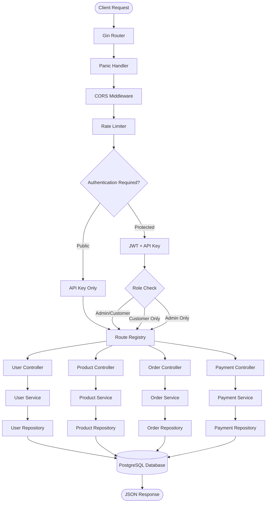
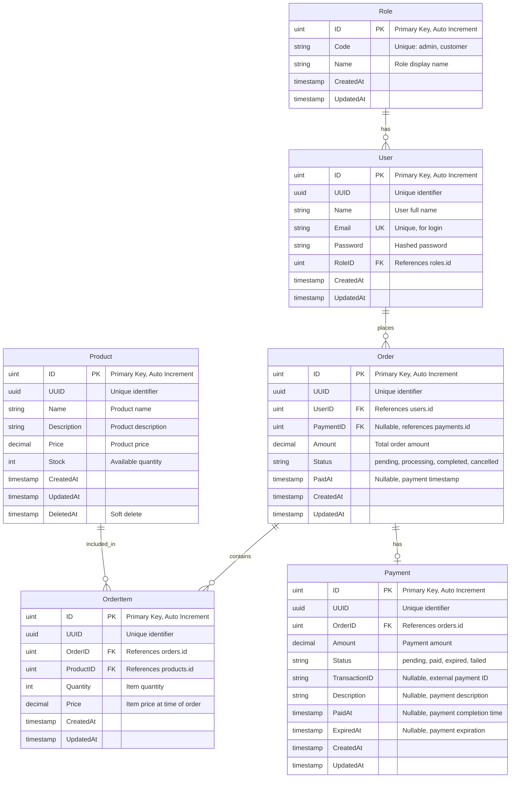

# Ecommerce Backend API

Backend API for ecommerce application built with Go, Gin, GORM, and PostgreSQL.

## Quick Start

### Option 1: Docker (Recommended)

```bash
# Clone repository
git clone <repository-url>
cd be_eco

# Create .env file
cp .env.example .env
# Edit .env with your configuration

# Start with Docker Compose
docker compose up -d

# Access API at http://localhost:8080
```

### Option 2: Local Development

**Prerequisites:**
- Go 1.24+
- PostgreSQL 15+ (server must be running)
- Make (optional)

**Installation:**

```bash
# Clone repository
git clone <repository-url>
cd be_eco

# Install dependencies
go mod download

# Setup environment variables
cp .env.example .env

# Run application
make run
```

### Testing

```bash
# Run all tests
go test -v ./...

# Unit tests only (no database required)
go test -v ./repositories/... ./services/... ./controllers/...

# Integration tests only (database created automatically)
go test -v ./tests/integration/...

# With coverage report
go test -v -coverprofile=coverage.out ./...
go tool cover -html=coverage.out -o coverage.html
```

> 💡 **Test database is created automatically** during integration tests.  
> 📖 For detailed testing guide, see [README_TESTING.md](README_TESTING.md)

**Test Coverage:**
- ✅ **Controllers**: Order, Payment, Product, User
- ✅ **Services**: Order, Payment, Product, User  
- ✅ **Repositories**: Order, OrderItem, Payment, Product, User
- ✅ **Integration Tests**: All API endpoints

## Available Commands

```bash
# Development
make run              # Run application
make build            # Build binary
make swagger          # Generate Swagger docs

# Testing
make test             # Run all tests
make test-unit        # Unit tests only (no database required)
make test-integration # Integration tests only (database created automatically)
make test-coverage    # Coverage report (generates coverage.html)
```

## Application Architecture

### Request Flow Diagram



### Layer Architecture

1. **Presentation Layer** (Routes + Controllers)
   - Handles HTTP requests/responses
   - Input validation
   - Error handling

2. **Business Logic Layer** (Services)
   - Business rules
   - Data transformation
   - Orchestration

3. **Data Access Layer** (Repositories)
   - Database operations
   - Query optimization
   - Data mapping

4. **Domain Layer** (Models + DTOs)
   - Entity models
   - Data transfer objects
   - Domain logic

## API Endpoints

### Authentication Endpoints

| Method | Endpoint | Authentication | Role | Description |
|--------|----------|----------------|------|-------------|
| POST | `/api/v1/auth/register` | API Key | Public | Register new user |
| POST | `/api/v1/auth/login` | API Key | Public | User login |

### Product Endpoints

| Method | Endpoint | Authentication | Role | Description |
|--------|----------|----------------|------|-------------|
| GET | `/api/v1/products` | JWT + API Key | Any authenticated | Get all products |
| POST | `/api/v1/products/create` | JWT + API Key | Admin, Customer | Create new product |

### Order Endpoints

| Method | Endpoint | Authentication | Role | Description |
|--------|----------|----------------|------|-------------|
| POST | `/api/v1/orders` | JWT + API Key | Customer | Create new order |
| GET | `/api/v1/orders/my` | JWT + API Key | Customer | Get my orders |

### Payment Endpoints

| Method | Endpoint | Authentication | Role | Description |
|--------|----------|----------------|------|-------------|
| POST | `/api/v1/payments/:orderUUID/pay` | JWT + API Key | Customer | Process payment for order |

### Role Definitions

- **Admin**: Full access to all resources, can create products
- **Customer**: Can view products, create orders, and process payments
- **Public**: No authentication required (register, login)

### Authentication Headers

All protected endpoints require:
```
Api-Key: <your-api-key>
Authorization: Bearer <jwt-token>
```

## Database Schema

The application uses PostgreSQL with the following entity relationships:



### Tables Description

| Table | Description | Key Features |
|-------|-------------|--------------|
| **roles** | User roles | Predefined roles: admin (ID: 1), customer (ID: 2) |
| **users** | User accounts | Email unique, password hashed, linked to role |
| **products** | Product catalog | Soft delete support, tracks stock quantity |
| **orders** | Customer orders | Links user to order items, optional payment link |
| **order_items** | Order line items | Stores product snapshot (price, quantity) at order time |
| **payments** | Payment records | Tracks payment status, transaction ID, expiration |

### Relationships

| Relationship | Type | Description | Constraint |
|--------------|------|-------------|------------|
| **Role → User** | One-to-Many | One role can have many users | CASCADE on update, RESTRICT on delete |
| **User → Order** | One-to-Many | One user can place many orders | CASCADE on update, RESTRICT on delete |
| **Order → OrderItem** | One-to-Many | One order contains many items | CASCADE on update, RESTRICT on delete |
| **Order → Payment** | One-to-One | One order can have one payment (optional) | CASCADE on update, RESTRICT on delete |
| **Product → OrderItem** | One-to-Many | One product can be in many order items | CASCADE on update, RESTRICT on delete |

### Status Values

**Order Status:**
- `pending`: Order created, awaiting payment
- `processing`: Payment received, order being processed
- `completed`: Order fulfilled
- `cancelled`: Order cancelled

**Payment Status:**
- `pending`: Payment initiated, awaiting completion
- `paid`: Payment completed successfully
- `expired`: Payment expired
- `failed`: Payment failed


## Environment Variables

```bash
# Application
APP_PORT=8080
APP_API_KEY=your-api-key

# Database
DB_HOST=localhost
DB_PORT=5432
DB_NAME=ecommerce
DB_USERNAME=postgres
DB_PASSWORD=postgres

# JWT
JWT_SECRET_KEY=your-secret-key
JWT_EXPIRATION_TIME=3600
```

## Docker Deployment

### Prerequisites
- Docker 20.10+
- Docker Compose 2.0+

### Quick Start with Docker

1. **Create `.env` file** (copy from `.env.example` if available):
```bash
cp .env.example .env
# Edit .env with your configuration
```

2. **Start services** (PostgreSQL + Go API):
```bash
docker compose up -d
```

3. **Check logs**:
```bash
# View all logs
docker compose logs -f

# View specific service logs
docker compose logs -f app
docker compose logs -f postgres
```

4. **Access the application**:
   - API: `http://localhost:8080`
   - Swagger: `http://localhost:8080/swagger/index.html`
   - Health Check: `http://localhost:8080/`

### Docker Commands

```bash
# Start services
docker compose up -d

# Stop services
docker compose down

# Stop and remove volumes (cleanup)
docker compose down -v

# Rebuild and start
docker compose up -d --build

# View running containers
docker compose ps

# Execute command in container
docker compose exec app sh
docker compose exec postgres psql -U postgres -d ecommerce
```

### Docker Compose Services

- **app**: Go API application (port 8080)
- **postgres**: PostgreSQL database (port 5432)

### Environment Variables for Docker

The `docker-compose.yml` uses environment variables from your `.env` file. Key variables:

```bash
# Application
APP_PORT=8080
APP_API_KEY=your-api-key

# Database (for app service, DB_HOST should be 'postgres' not 'localhost')
DB_HOST=postgres
DB_PORT=5432
DB_NAME=ecommerce
DB_USERNAME=postgres
DB_PASSWORD=postgres

# JWT
JWT_SECRET_KEY=your-secret-key
JWT_EXPIRATION_TIME=3600
```

> ⚠️ **Note**: When running in Docker, set `DB_HOST=postgres` (service name) instead of `localhost` in your `.env` file.

### Build Docker Image Manually

```bash
# Build image
docker build -t ecommerce-api:latest .

# Run container
docker run -d \
  --name ecommerce-api \
  -p 8080:8080 \
  --env-file .env \
  ecommerce-api:latest
```

## Documentation

- **[Testing Guide](README_TESTING.md)** - Testing documentation
- **Swagger Docs** - `http://localhost:8080/swagger/index.html`
